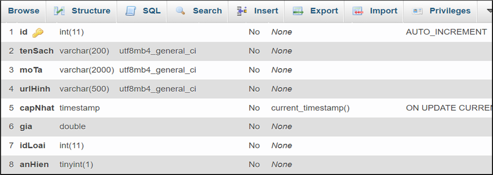
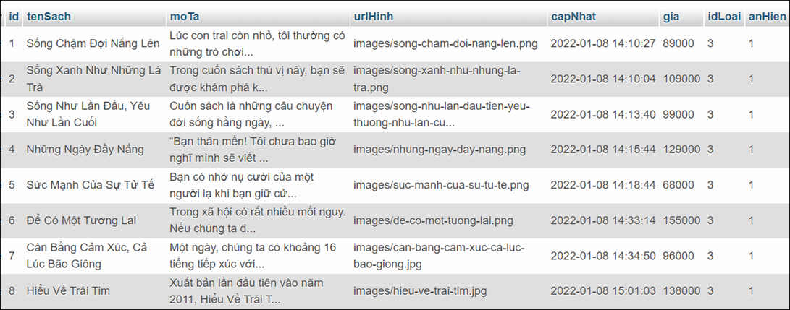
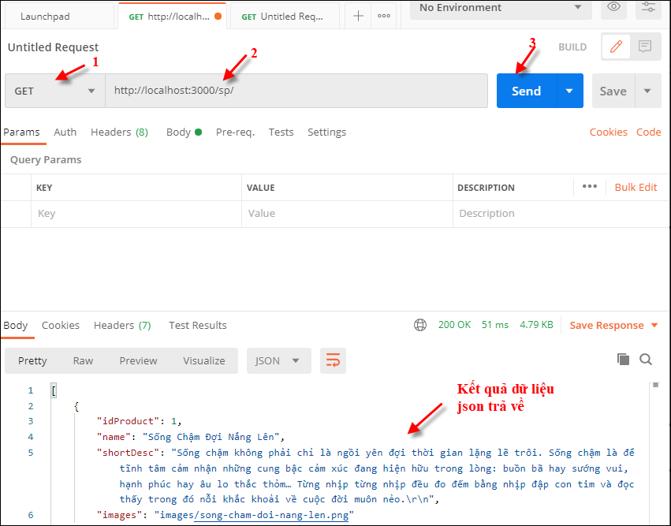
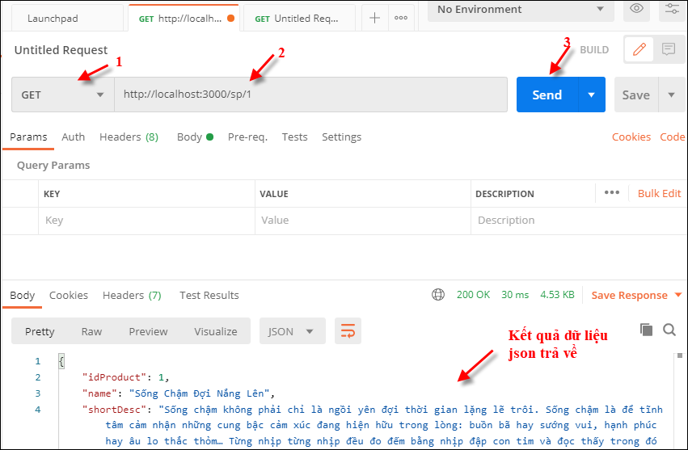
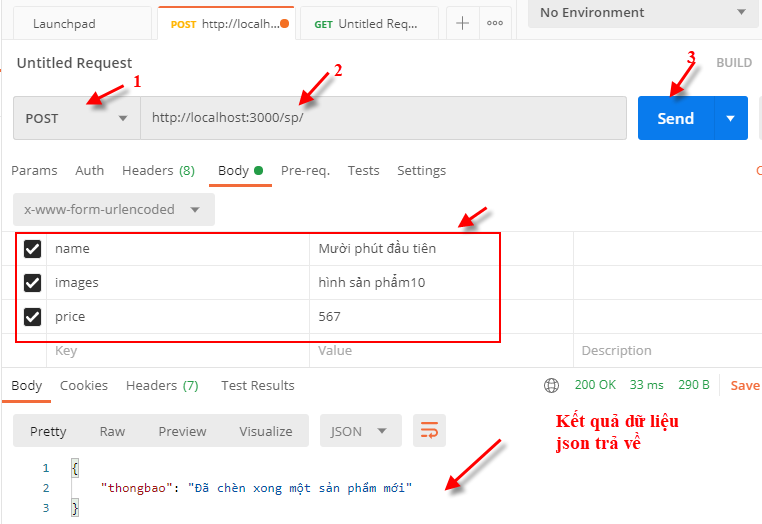
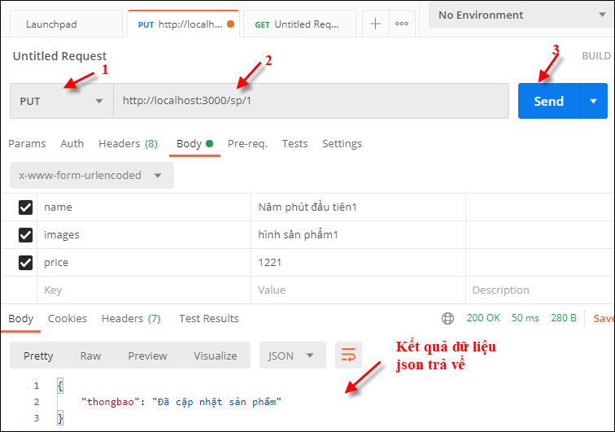
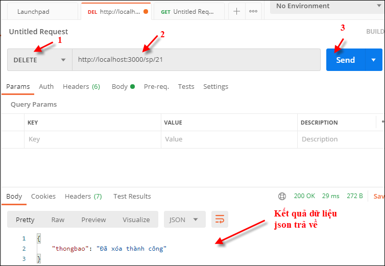

# WEB503 - NODEJS
Development by Tran Huu Dang

<details >
<summary>

## Bài 01: Calculator 
</summary>

### Chưa cập nhật
</details>


<details >
<summary>

## Bài 02: EJS Template
</summary>

### Chưa cập nhật
</details>

<details >
<summary>

## Bài 03: CRUD Trong NODEJS
</summary>

### Chưa cập nhật
</details>


<details >
<summary>

## Bài 04: CONNECT DATABSE 
</summary>

### Chưa cập nhật
</details>


<details >
<summary>

## Bài 05: REST full API 
</summary>
<br>
 REST là gì?  REST – viết đầy đủ là REpresentational State Transfer – là một chuẩn trong lập trình, nó định nghĩa các quy tắc để tạo ra các web service nhằm cung cấp các chức năng truy xuất, thêm mới, cập nhật tài nguyên từ xa qua http.  Restful API diễn dịch lại dữ liệu giữa các hệ thống ứng dụng và máy tính, tạo nên khả năng truyền tải dữ liệu đơn giản mà hiệu quả, phục vụ trao đổi dữ liệu giữa các nền tảng khác nhau và xa nhau.

Với Restful, bạn sẽ tạo nên khả năng truy cập tài nguyên cho client thông qua các URI. Dữ liệu trả về sẽ trong dạng json, xml, html nhưng chủ yếu là json. Restful sử dụng HTTP như cỗ xe chuyên chở dữ liệu giữa server và client qua các method GET, HEAD, POST, PUT, PATCH, DELETE…

### Các quy định http method trong restful


|HTTP method|Mô tả|
|-----------|-----|
|`GET`|Dùng để lấy một tài nguyên hoặc danh sách các tài nguyên từ server (đã representation lại theo dạng json, xml…)|
|`POST`|Gửi đến server tài nguyên để xử lý (thường dùng cho thêm mới record)|
|`PUT`|Ấn định trạng thái mới cho tài nguyên trên server (thường dùng cho update record)|
|`DELETE`|Xóa tài nguyên chỉ định trên server|
--------------
#### Khi request đến một tài nguyên, các status code sẽ trả về client :
- 200 OK – Tra về trong các phương thức GET, PUT, PATCH, DELETE.
- 201 Created – Trả về khi tạo xong tài nguyên
- 204 No Content – Trả về khi xoá xong 1 tài nguyên
- 304 Not Modified – Tài nguyên không có thay đổi, client có thể dùng cache.
- 400 Bad Request – Request không hợp lệ
- 401 Unauthorized – Request không quyền truy cập.
- 403 Forbidden – Request bị bẻ gãy, từ chối truy cập.
- 404 Not Found – Không tìm thấy tài nguyên trong từ URI
- 405 Method Not Allowed – Phương thức không được phép
- 410 Gone – Tài nguyên không tồn tại
- 415 Unsupported Media Type – Không hỗ trợ kiểu tài nguyên
- 422 Unprocessable Entity – Dữ liệu không được xử lý
- 429 Too Many Requests – Có quá nhiều request
- 500 Code Error - Lỗi do mã code

------
## Thực hiện restful api trong nodejs
### Chuẩn bị database
Tạo table tên sach như sau: <br>

Nhập dữ liệu 


### Cài module express và express-generator
Nếu máy của bạn đã cài rồi thì thôi bỏ qua, còn chưa thì
1. Mở command line
2. Gõ  lệnh npm `install -g express`
3. Tiếp theo gõ lệnh  `npm -g install express-generator`

### Tạo project để thực tập
1. Vào command line rồi chạy lệnh:
```bash
express --=ejs RestfulTest
```
2. Chuyển vào folder RestfulTest mới tạo và chạy các lệnh cài đặt module cần thiết
```npm
npm install
npm install mysql
```

### Tạo model kết nối db
1. Tạo folder models trong project

2. Tạo file file models/database.js

```js
var mysql = require('mysql');
var db = mysql.createConnection({
   host: 'localhost', 
   user: 'root', 
   password: '', 
   database: 'labnodejs'
}); 
db.connect(() => console.log('Da ket noi database !'));
module.exports = db; 
```

### Tạo route
1. Mở file app.js và định nghĩa route sach dẫn vào controller routes/sach
```js
var sachRouter = require('./routes/sach');
app.use('/sach', sachRouter);
```
2. Tạo file routes/sach.js và code
```js
var express = require('express');
 var router = express.Router();
 var db = require('./../models/database'); 
 router.get('/', function(req, res, next) {
     //chức năng trả về danh sách các record
     //phương thức request: get
     //lấy ra các record trong table
     //trả về danh sách sách dạng json
 });
 router.post('/', function(req, res, next) {
     //chức năng thêm mới record vào table
     //phương thức request: post
     //tiếp nhận dữ liệu gửi trong body request
     //thực hiện chèn record mới vào table 
     //trả về thông báo đã chèn dạng json 
 });
 router.get('/:id', function(req, res, next) {
     //chức năng trả về chi tiết 1 record
     //phương thức request: get
     //tiếp nhận id của reord trong url
     //lấy ra record theo id từ table
     //trả về chi tiết record dạng json
 });
 router.put('/:id', function(req, res, next) {
     //chức năng cập nhật record trong table 
     //phương thức request: put
     //tiếp nhận dữ liệu gửi trong body request
     //thực hiện cập nhật record vào table 
     //trả về thông báo json đã cập nhật
 });
 router.delete('/:id', function(req, res) { 
     //chức năng xóa 1 record trong table
     //phương thức request: delete
     //tiếp nhận id trong url
     //thực hiện xóa record
     //trả về thông báo json đã xóa
 });
 module.exports = router;
 ```
### Thực hiện chức năng danh sách record
1. Trong routes/sach.js, code lại chức năng trả về danh sách các record để được như sau
```js
router.get('/', function(req, res, next) {
    let sql = `SELECT id, tenSach, moTa, urlHinh FROM sach`;
    db.query(sql, function(err, data) {
        res.json(data);
    });   
});
```
2. Test: Mở Postman để test
Trình Postman download từ https://www.postman.com/downloads/ , giúp bạn tạo các loại request khác nhau (get, post, put, delete…) đến server. Nếu bạn chưa cài thì down rồi cài vào máy nhé.

Mở chương trình postman, chọn method GET và nhập url rồi nhắp Send như hình




### Thực hiện lấy chi tiết record
1. Trong routes/sach.js, code lại chức năng trả về chi tiết 1 record để được như sau
```js
router.get('/:id', function(req, res, next) {
    let id=req.params.id;      
    let sql = 'SELECT * FROM sach WHERE id = ?'    
    db.query(sql, id, (err, d) => {
       res.json(d[0]);
    });   
});
```
2. Test: Mở Postman để test

Trong tool postman, chọn method GET và nhập url rồi nhắp Send như hình


### Thực hiện chức năng thêm record
1. Trong routes/sach.js, code lại chức năng thêm mới record vào table để được như sau:
```js
router.post('/', function(req, res, next) {
    let data = req.body;  
    let sql = 'INSERT INTO sach SET ?';
    db.query(sql, data, (err, d) => {
        if (err) throw err;
        res.json({"thongbao":"Đã chèn xong sách"});
    });
});
```
2. Test: Mở Postman để test

Trong tool postman, chọn method POST và nhập url rồi nhắp Send như hình



### Thực hiện chức năng cập nhật record
1. Trong routes/sach.js, code lại chức năng cập nhật record trong table để được như sau:
```js
router.put('/:id', function(req, res, next) {
    let data = req.body;
    let id = req.params.id;
    let sql = 'UPDATE sach SET ? WHERE id = ?';
    db.query(sql, [data, id], (err, d) => {
        if (err) throw err;
        res.json({"thongbao": 'Đã cập nhật sách'});
    });
});
```
2. Test: Mở Postman để test

Trong tool postman, chọn method PUT và nhập url rồi nhắp Send như hình


### Thực hiện chức năng xóa record
1. Trong routes/sach.js, code lại chức năng xóa record trong table để được như sau:
```js
router.delete('/:id', function(req, res) { 
    let id = req.params.id;
    let sql = 'DELETE FROM sach WHERE id = ?'
    db.query(sql, id , (err, d) => {
        if (err) throw err;
        res.json({"thongbao": 'Đã xóa thành công'});
    }); 
});
```
2. Test: Mở Postman để test

Trong tool postman, chọn method DELETE và nhập url rồi nhắp Send như hình



Trên đây là phần hướng dẫn RESTful API trong NodeJS, bao gồm các khái niệm, cách tạo api, cách test. Các vấn đề liên quan vẫn còn, đó là authentication trong restful, validation, kết hợp với phần front end… sẽ được trình bày tiếp sau.

Bài tập: mời bạn thực hiện tạo bộ các hàm restful api tương tự như trình bày ở trên nhưng với table loai.
</details>


## Clone repo về máy
Mở thư mục sau:<br>
<br>
Chuột phải -> Mở bằng Terminal:
<br>

Gõ lần lượt các lệnh sau và nhấn enter (mỗi lệnh enter một lần):

`npm init` <br>
`npm install --save express`<br>
`npm install --save nodemon`<br>
`npm install --save ejs` <br>
`npm install --save multer`<br>


<br>
Cấu trúc dự án sau khi cài đặt thành công: <br/>


## Chạy dự án:

Chạy từng bài lab trong project

Ví dụ chạy lab01: `cd lab01` -> `node index.js`

Ví dụ chạy lab02: `cd..` -> `cd lab02` -> `node index.js`

----

